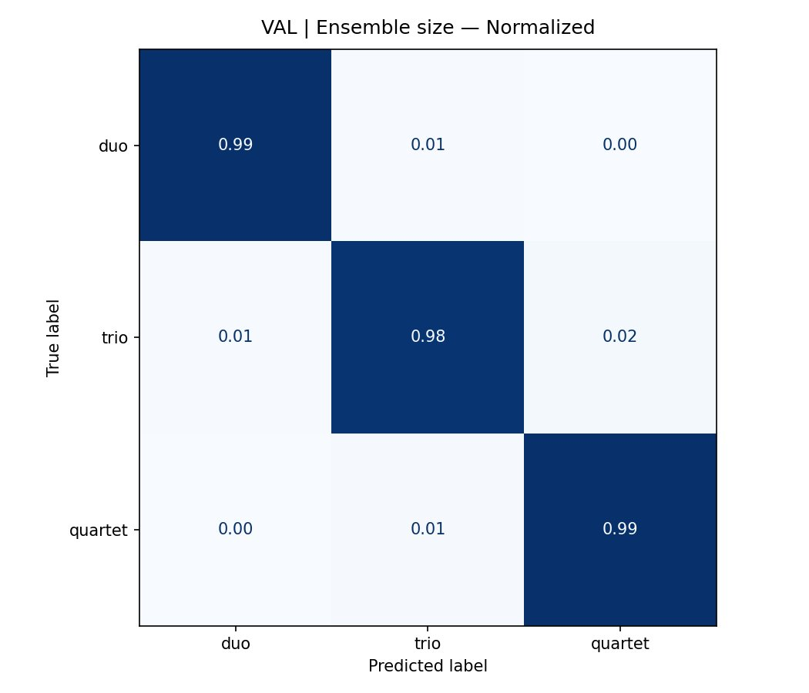
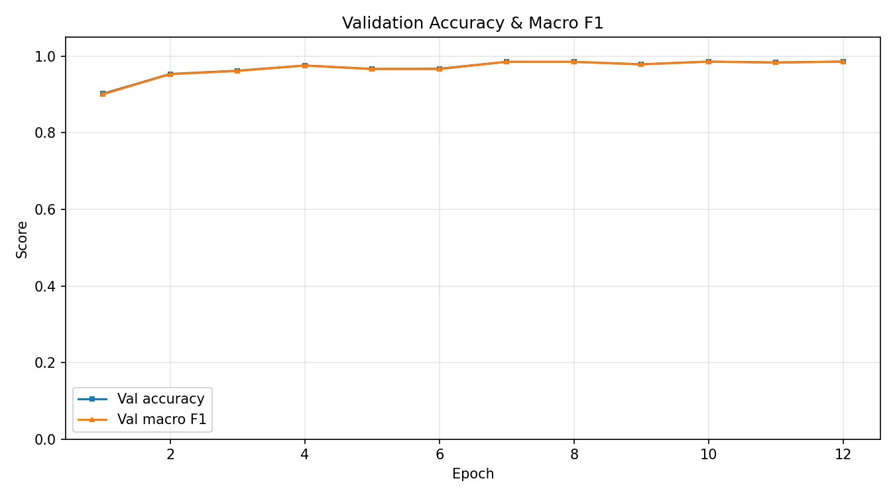
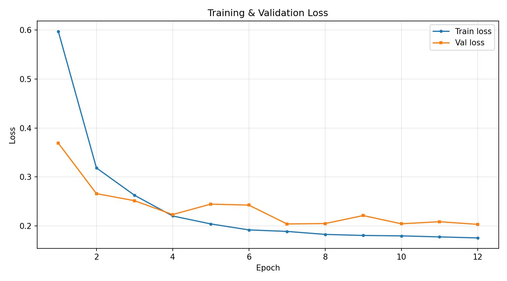

# EXP1 — Ensemble Size Classification

## Task

Classify whether a string ensemble audio clip contains a **duo** (2 instruments), **trio** (3), or **quartet** (4).

## Model

| Component | Detail |
|---|---|
| Backbone | `MIT/ast-finetuned-audioset-10-10-0.4593` |
| Head | Two-layer MLP |
| Input | 128 × 256 mel spectrogram |
| Classes | `duo`, `trio`, `quartet` |

## Results

### Test set

| Class | Precision | Recall | F1 |
|---|---|---|---|
| duo | 0.9922 | 0.9936 | 0.9929 |
| trio | 0.9812 | 0.9768 | 0.9790 |
| quartet | 0.9861 | 0.9886 | 0.9873 |
| **macro avg** | **0.9865** | **0.9863** | **0.9864** |
| **accuracy** | | | **0.9867** |

### Validation set

| Class | Precision | Recall | F1 |
|---|---|---|---|
| duo | 0.9927 | 0.9933 | 0.9930 |
| trio | 0.9823 | 0.9753 | 0.9788 |
| quartet | 0.9841 | 0.9896 | 0.9869 |
| **macro avg** | **0.9864** | **0.9861** | **0.9862** |
| **accuracy** | | | **0.9865** |

## Figures

| | |
|---|---|
|  |  |
|  |  |

## Notebook

[`SECD_EXP1_AST_ENSEMBLE_SIZE.ipynb`](SECD_EXP1_AST_ENSEMBLE_SIZE.ipynb)
