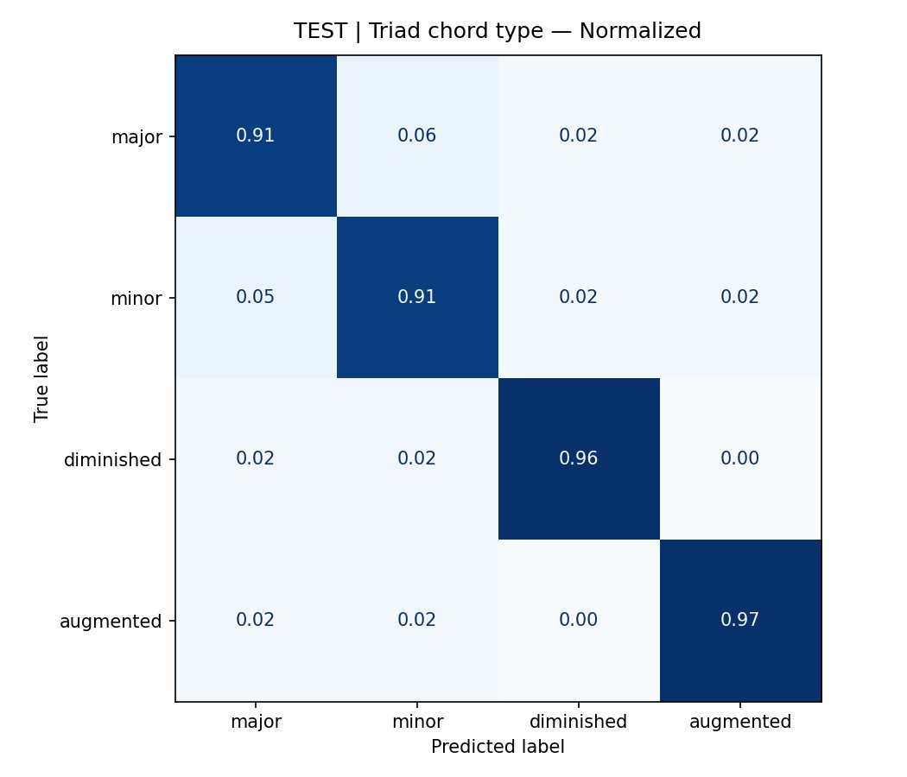
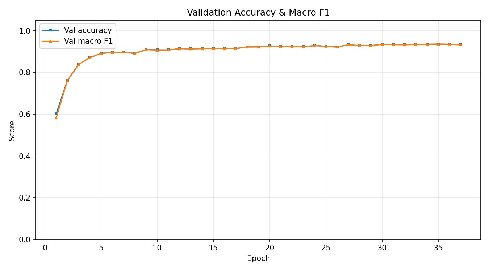
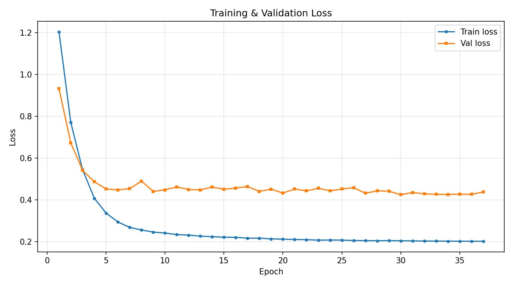

# EXP2 — Triad Chord Quality Classification

## Task

Classify the **chord quality** of a string ensemble triad recording:
**major**, **minor**, **diminished**, or **augmented**.

## Model

| Component | Detail |
|---|---|
| Backbone | `MIT/ast-finetuned-audioset-10-10-0.4593` |
| Head | Two-layer MLP |
| Input | 128 × 256 mel spectrogram |
| Classes | `major`, `minor`, `diminished`, `augmented` |
| Instrument order | cello · viola · violin2 · violin1 |

## Results

### Test set

| Class | Precision | Recall | F1 |
|---|---|---|---|
| major | 0.9153 | 0.9095 | 0.9124 |
| minor | 0.9032 | 0.9146 | 0.9088 |
| diminished | 0.9653 | 0.9598 | 0.9625 |
| augmented | 0.9657 | 0.9651 | 0.9654 |
| **macro avg** | **0.9374** | **0.9372** | **0.9373** |
| **accuracy** | | | **0.9373** |

### Validation set

| Class | Precision | Recall | F1 |
|---|---|---|---|
| major | 0.9175 | 0.9045 | 0.9109 |
| minor | 0.8998 | 0.9206 | 0.9101 |
| diminished | 0.9598 | 0.9522 | 0.9560 |
| augmented | 0.9654 | 0.9645 | 0.9649 |
| **macro avg** | **0.9356** | **0.9354** | **0.9355** |
| **accuracy** | | | **0.9355** |

> **Note:** The major/minor confusion (~5–6%) is acoustically expected — these two qualities differ only in one semitone interval and are the hardest to distinguish in polyphonic ensemble audio.

## Figures

| | |
|---|---|
|  |  |
|  |  |

## Notebook

[`SECD_EXP2_AST_TRIADS_CHORDTYPE_FIXED.ipynb`](SECD_EXP2_AST_TRIADS_CHORDTYPE_FIXED.ipynb)
