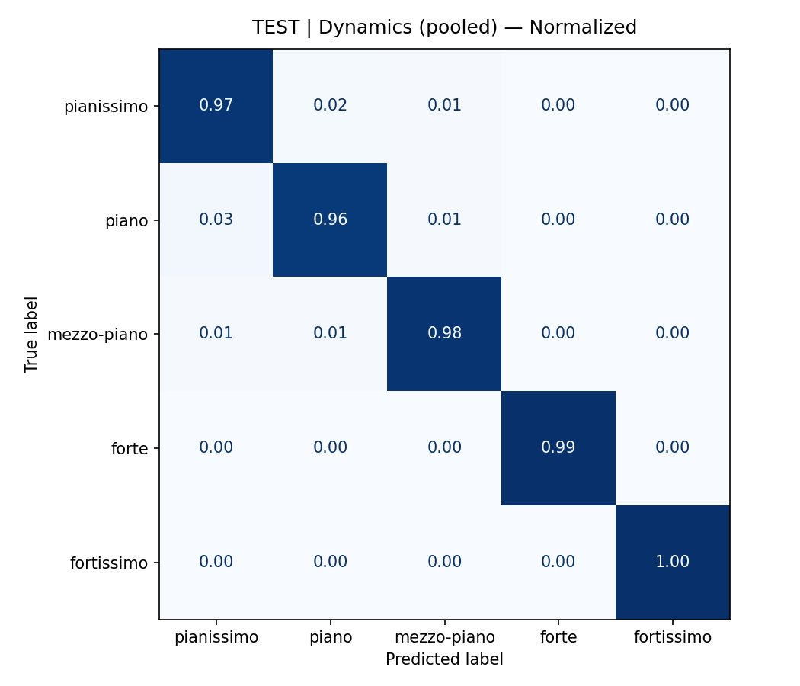
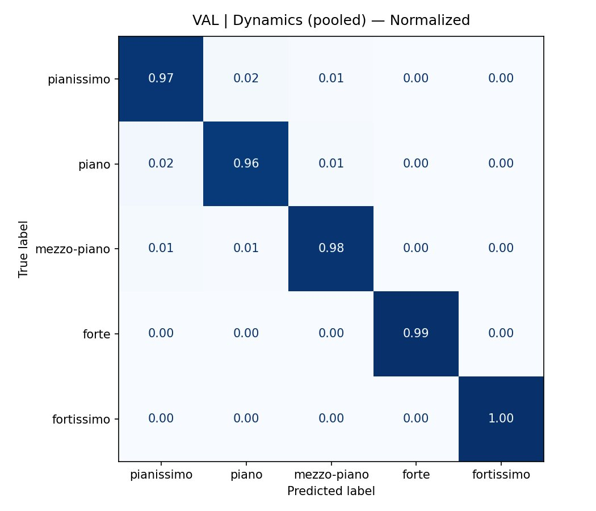
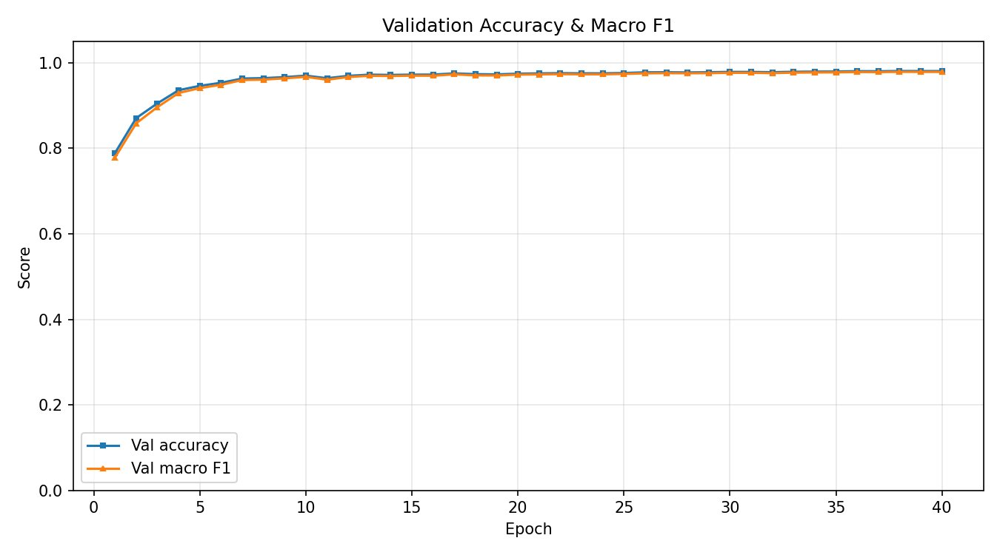
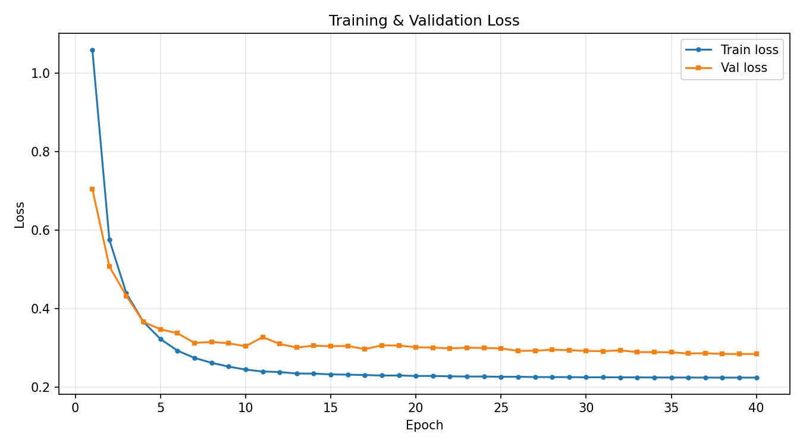

# EXP3 — Dynamics Classification (per-instrument, arco)

## Task

Per-instrument **dynamics classification** from string ensemble audio.
Each instrument head predicts one of 5 dynamic levels:
**pianissimo (pp)**, **piano (p)**, **mezzo-piano (mp)**, **forte (f)**, **fortissimo (ff)**.

## Model

| Component | Detail |
|---|---|
| Backbone | `MIT/ast-finetuned-audioset-10-10-0.4593` |
| Architecture | Per-instrument heads with masked CE loss |
| Input | 128 × 256 mel spectrogram |
| Classes | `pianissimo`, `piano`, `mezzo-piano`, `forte`, `fortissimo` |
| Instrument order | cello · viola · violin2 · violin1 |

## Results — Pooled (all instruments)

### Test set

| Class | Precision | Recall | F1 |
|---|---|---|---|
| pianissimo | 0.9742 | 0.9726 | 0.9734 |
| piano | 0.9596 | 0.9608 | 0.9602 |
| mezzo-piano | 0.9797 | 0.9776 | 0.9786 |
| forte | 0.9927 | 0.9928 | 0.9927 |
| fortissimo | 0.9944 | 0.9967 | 0.9956 |
| **macro avg** | **0.9801** | **0.9801** | **0.9801** |
| **accuracy** | | | **0.9819** |

### Per-instrument Test Accuracy

| Instrument | Accuracy | Macro F1 |
|---|---|---|
| cello | 99.73% | 99.72% |
| viola | 98.79% | 98.75% |
| violin1 | 97.63% | 97.45% |
| violin2 | 89.46% | 87.10% |

> **Note:** violin2 shows lower performance (~87% macro F1), consistent with its smaller sample count and more variable role in the ensemble texture.

## Figures

| | |
|---|---|
|  |  |
|  |  |

## Notebook

[`SECD_EXP3_AST_DYN_ARCO.ipynb`](SECD_EXP3_AST_DYN_ARCO.ipynb)
