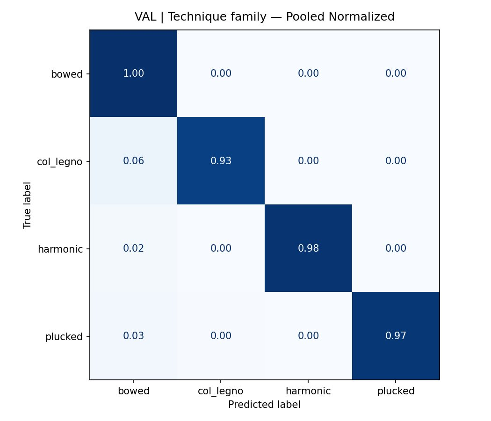
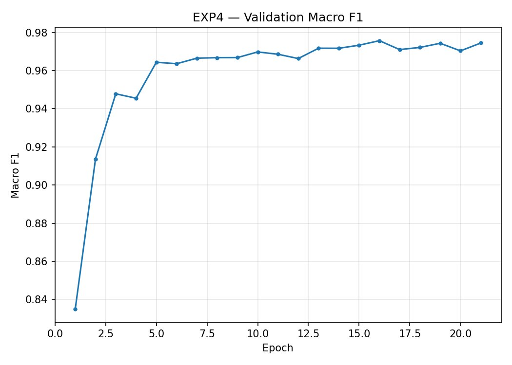
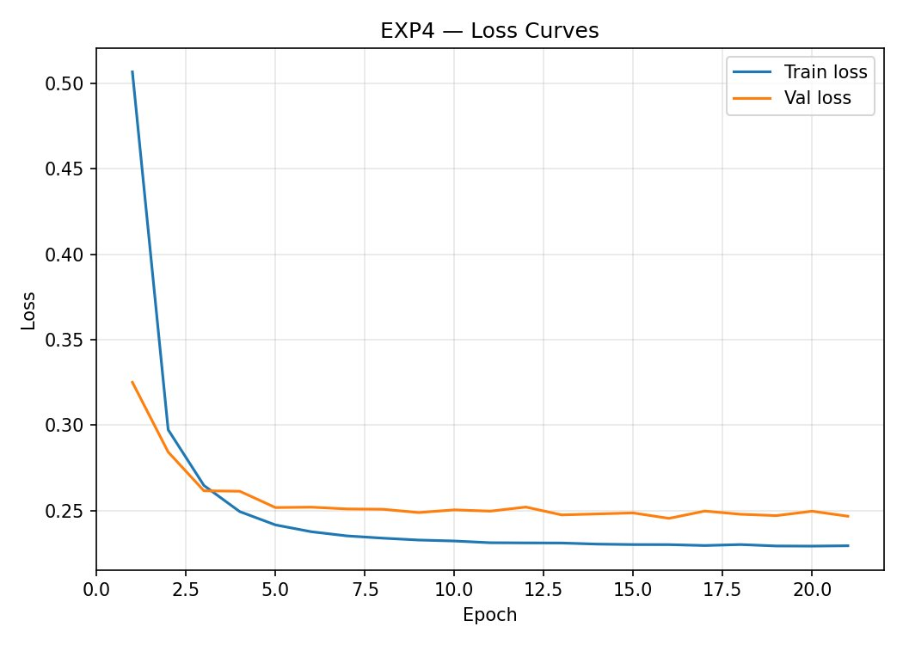

# EXP4 — Playing Technique Family Classification

## Task

Per-instrument **playing technique family classification** from string ensemble audio.
Each instrument head predicts one of 4 technique families:
**bowed**, **col_legno**, **harmonic**, **plucked**.

## Model

| Component | Detail |
|---|---|
| Backbone | `MIT/ast-finetuned-audioset-10-10-0.4593` |
| Architecture | `ASTMultiHeadFamilies` — CLS token pooling, 4 per-instrument heads with instrument embeddings |
| Input | 128 × 256 mel spectrogram |
| Classes | `bowed`, `col_legno`, `harmonic`, `plucked` |
| Instrument order | cello · viola · violin2 · violin1 |
| Loss | Masked CE (absent instruments excluded per sample) |
| Class weighting | Effective Number of Samples (Cui et al. 2019, β=0.9999) |

## Results — Pooled (all instruments)

### Test set

| Class | Precision | Recall | F1 |
|---|---|---|---|
| bowed | 0.9954 | 0.9982 | 0.9968 |
| col_legno | 0.9560 | 0.9214 | 0.9384 |
| harmonic | 0.9813 | 0.9745 | 0.9779 |
| plucked | 0.9925 | 0.9649 | 0.9785 |
| **macro avg** | **0.9813** | **0.9647** | **0.9729** |
| **accuracy** | | | **0.9939** |

### Per-instrument Test Accuracy

| Instrument | Accuracy | Macro F1 | Note |
|---|---|---|---|
| cello | 99.94% | 99.59%* | No plucked samples |
| viola | 99.73% | 99.70%* | No col_legno samples |
| violin1 | 99.17% | 97.66% | |
| violin2 | 97.72% | 91.87% | Smallest sample count |

> \* Macro avg artificially deflated by zero-support classes (instrument never plays that technique). Weighted avg is the more informative metric for these instruments.

> **Note:** col_legno is the hardest family to classify (~92% recall), acoustically consistent with its timbral similarity to bowed playing in short transients.

## Figures

| | |
|---|---|
|  |  |
|  |  |

## Notebook

[`SECD_EXP4_TEC_FAM__2_.ipynb`](SECD_EXP4_TEC_FAM__2_.ipynb)
